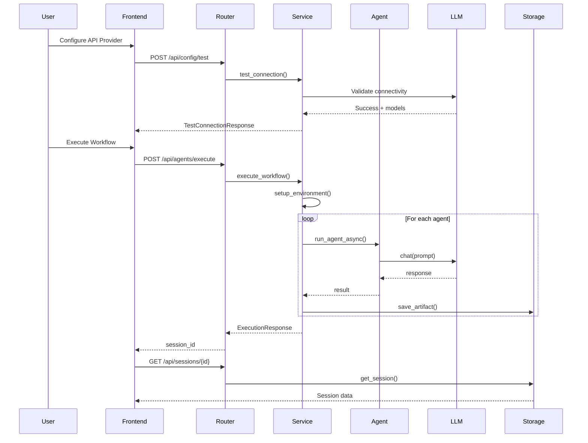

# Agentic Scrum Platform - Detailed Technical Design

## Document Information
**Version**: 1.0  
**Last Updated**: November 19, 2025  
**Author**: Development Team  
**Status**: Current Implementation + Planned Enhancements

---

## Table of Contents
1. [System Architecture](#system-architecture)
2. [Technology Stack](#technology-stack)
3. [Component Design](#component-design)
4. [Data Models](#data-models)
5. [API Specifications](#api-specifications)
6. [Agent Orchestration](#agent-orchestration)
7. [Enhancement Implementations](#enhancement-implementations)
8. [Security & Performance](#security--performance)
9. [Testing Strategy](#testing-strategy)
10. [Deployment Architecture](#deployment-architecture)

---

## 1. System Architecture

### 1.1 High-Level Architecture

```
┌─────────────────────────────────────────────────────────────────┐
│                        Client Browser                            │
│  ┌──────────────────────────────────────────────────────────┐  │
│  │  Next.js 16.0.3 Frontend (React 19.2.0)                  │  │
│  │  - Pages: Home, Configure, Execute, History              │  │
│  │  - State: Zustand stores (config, execution)             │  │
│  │  - API Client: TanStack Query v5                         │  │
│  └──────────────────────────────────────────────────────────┘  │
└────────────────────────┬────────────────────────────────────────┘
                         │ HTTP/SSE
                         ▼
┌─────────────────────────────────────────────────────────────────┐
│                    FastAPI Backend (0.121.3)                     │
│  ┌──────────────┐  ┌──────────────┐  ┌──────────────┐         │
│  │   Routers    │  │   Services   │  │   Core       │         │
│  │              │  │              │  │              │         │
│  │ - agents.py  │→│ agent_svc    │→│ agents.py    │         │
│  │ - config.py  │  │ azure_svc    │  │ azure_patch  │         │
│  │ - sessions   │  │ storage_svc  │  │ agents_cfg   │         │
│  │ - artifacts  │  └──────────────┘  └──────────────┘         │
│  └──────────────┘                                               │
└────────────┬────────────────────────────────────────────────────┘
             │
             ▼
┌─────────────────────────────────────────────────────────────────┐
│                    AI Provider Layer                             │
│  ┌──────────┐   ┌──────────────┐   ┌──────────────────┐       │
│  │  Ollama  │   │   OpenAI     │   │  Azure OpenAI    │       │
│  │  Local   │   │   GPT-4      │   │   + APIM         │       │
│  └──────────┘   └──────────────┘   └──────────────────┘       │
└─────────────────────────────────────────────────────────────────┘
             │
             ▼
┌─────────────────────────────────────────────────────────────────┐
│                    Storage Layer                                 │
│  ┌──────────────────────┐   ┌──────────────────────┐           │
│  │  File System         │   │  Session Store       │           │
│  │  backend/output/     │   │  (In-Memory/Future   │           │
│  │  {session_id}/       │   │   Database)          │           │
│  └──────────────────────┘   └──────────────────────┘           │
└─────────────────────────────────────────────────────────────────┘
```

### 1.2 Component Interaction Flow



---

## 2. Technology Stack

### 2.1 Current Implementation

| Layer | Technology | Version | Purpose |
|-------|------------|---------|---------|
| **Frontend Framework** | Next.js | 16.0.3 | React framework with SSR |
| **UI Library** | React | 19.2.0 | Component rendering |
| **State Management** | Zustand | 5.0.8 | Global state (config, execution) |
| **Data Fetching** | TanStack Query | 5.90.10 | API calls, caching, mutations |
| **Form Handling** | react-hook-form | 7.66.1 | Form validation |
| **UI Components** | shadcn/ui | Latest | Accessible component library |
| **Styling** | Tailwind CSS | 3.x | Utility-first CSS |
| **Backend Framework** | FastAPI | 0.121.3 | REST API server |
| **ASGI Server** | Uvicorn | 0.38.0 | Async server |
| **Validation** | Pydantic | 2.12.4 | Data validation |
| **Agent Framework** | PraisonAI Agents | 0.0.162 | Multi-agent orchestration |
| **LLM SDK** | OpenAI | 2.8.1 | LLM interactions |
| **Azure SDK** | azure-identity | 1.19.0 | Azure authentication |

### 2.2 Planned Additions (Phase 1-3)

| Component | Technology | Purpose |
|-----------|------------|---------|
| **Real-time Updates** | Server-Sent Events (SSE) | Live progress streaming |
| **Syntax Highlighting** | Prism.js / Shiki | Code display in artifacts |
| **Markdown Rendering** | react-markdown | Formatted output display |
| **Charts/Metrics** | Recharts | Resource monitoring graphs |
| **PDF Generation** | ReportLab (Python) | Export to PDF |
| **Database** | PostgreSQL / SQLite | Persistent storage (future) |

---

## 3. Component Design

### 3.1 Frontend Architecture

#### State Management (Zustand)

**config-store.ts**
```typescript
interface ConfigStore {
  apiMode: 'ollama' | 'openai' | 'azure' | null;
  ollamaConfig: { url: string; model: string };
  openaiConfig: { apiKey: string; model: string };
  azureConfig: { 
    apiKey: string; 
    endpoint: string; 
    deployment: string; 
    apiVersion: string 
  };
  
  setApiMode: (mode: string) => void;
  setOllamaConfig: (config) => void;
  setOpenAIConfig: (config) => void;
  setAzureConfig: (config) => void;
}
```

**execution-store.ts**
```typescript
interface ExecutionStore {
  sessionId: string | null;
  status: 'idle' | 'running' | 'completed' | 'failed';
  currentAgent: string | null;
  agents: AgentStatus[];
  logs: string[];
  
  startExecution: (sessionId: string) => void;
  updateAgentStatus: (agentName: string, status: string) => void;
  addLog: (message: string) => void;
  reset: () => void;
}
```

#### API Client Hooks (TanStack Query)

**use-config.ts**
```typescript
export function useTestConnection() {
  return useMutation({
    mutationFn: async (config: TestConnectionRequest) => {
      const response = await fetch('/api/config/test', {
        method: 'POST',
        body: JSON.stringify(config),
      });
      return response.json();
    },
  });
}
```

**use-agents.ts**
```typescript
export function useExecuteAgents() {
  return useMutation({
    mutationFn: async (request: ExecutionRequest) => {
      const response = await fetch('/api/agents/execute', {
        method: 'POST',
        body: JSON.stringify(request),
      });
      return response.json();
    },
  });
}

// Phase 1 Enhancement: SSE streaming
export function useAgentStream(sessionId: string) {
  const [status, setStatus] = useState<AgentStatus[]>([]);
  
  useEffect(() => {
    const eventSource = new EventSource(
      `/api/agents/stream/${sessionId}`
    );
    
    eventSource.onmessage = (event) => {
      const data = JSON.parse(event.data);
      setStatus(data.agents);
    };
    
    return () => eventSource.close();
  }, [sessionId]);
  
  return { status };
}
```

### 3.2 Backend Architecture

#### Service Layer Pattern

**agent_service.py** (Orchestration Logic)
```python
class AgentService:
    def __init__(self):
        apply_patch()  # Azure APIM patch
        
    def setup_environment(self, config: ExecutionRequest):
        """Configure env vars for AI provider"""
        
    async def execute_workflow(
        self, 
        config: ExecutionRequest,
        session_id: str,
        status_callback: Callable = None,
        log_callback: Callable = None
    ) -> Dict:
        """Sequential agent execution with callbacks"""
        
        agent_sequence = [
            "product_owner",
            "scrum_master", 
            "developer",
            "qa_automation",
            "scrum_summary"
        ]
        
        for agent_name in agent_sequence:
            # Update status
            if status_callback:
                await status_callback(agent_name, "running")
            
            # Execute agent
            result = await run_agent_async(
                instructions=agent_cfg["instructions"],
                prompt=build_prompt(agent_name, inputs, results)
            )
            
            # Save artifact
            storage.save_artifact(session_id, agent_name, result)
            
            # Update status
            if status_callback:
                await status_callback(agent_name, "completed")
```

**storage_service.py** (File System Operations)
```python
class StorageService:
    def __init__(self, base_dir: str = "output"):
        self.base_dir = Path(base_dir)
        
    def create_session(self, session_id: str) -> Path:
        """Create session directory"""
        
    def save_artifact(
        self, 
        session_id: str, 
        agent_name: str, 
        content: str
    ):
        """Save agent output to file"""
        
    def list_artifacts(self, session_id: str) -> List[Artifact]:
        """List all files in session"""
        
    def get_artifact_content(
        self, 
        session_id: str, 
        filename: str
    ) -> str:
        """Read artifact content"""
        
    def delete_session(self, session_id: str) -> bool:
        """Remove session and all artifacts"""
```

**azure_service.py** (Azure OpenAI + APIM)
```python
class AzureService:
    def test_azure_connection(self, config: Dict) -> Dict:
        """Validate Azure OpenAI + APIM routing"""
        
    def get_apim_headers(self) -> Dict:
        """Generate custom headers for APIM"""
        return {
            "X-Custom-Header": "value",
            "Ocp-Apim-Subscription-Key": os.environ.get("APIM_KEY")
        }
```

#### Router Layer (REST Endpoints)

**agents.py**
```python
@router.post("/execute")
async def execute_agents(
    request: ExecutionRequest, 
    background_tasks: BackgroundTasks
):
    """Start agent workflow"""
    session_id = str(uuid.uuid4())
    
    # Initialize session
    storage = get_storage_service()
    storage.create_session(session_id)
    
    # Execute in background
    background_tasks.add_task(
        execute_workflow_task,
        session_id,
        request
    )
    
    return ExecutionResponse(
        sessionId=session_id,
        status="running"
    )

# Phase 1 Enhancement: SSE streaming
@router.get("/stream/{session_id}")
async def stream_execution(session_id: str):
    """Stream real-time agent status"""
    async def event_generator():
        while True:
            status = get_agent_status(session_id)
            yield f"data: {json.dumps(status)}\n\n"
            
            if status["status"] in ["completed", "failed"]:
                break
                
            await asyncio.sleep(1)
    
    return StreamingResponse(
        event_generator(),
        media_type="text/event-stream"
    )
```

---

## 4. Data Models

### 4.1 Current Pydantic Models

**models/config.py**
```python
class OllamaConfig(BaseModel):
    url: str = "http://localhost:11434"
    model: str = "llama2"

class OpenAIConfig(BaseModel):
    apiKey: str
    model: str = "gpt-4"

class AzureConfig(BaseModel):
    apiKey: str
    endpoint: str
    deployment: str
    apiVersion: str = "2024-02-01"

class ApiConfig(BaseModel):
    mode: Literal["ollama", "openai", "azure"]
    url: Optional[str] = None
    model: Optional[str] = None
    apiKey: Optional[str] = None
    endpoint: Optional[str] = None
    deployment: Optional[str] = None
    apiVersion: Optional[str] = None
```

**models/agents.py**
```python
class AgentStatus(BaseModel):
    name: str
    status: Literal["pending", "running", "completed", "failed"]
    startTime: Optional[datetime] = None
    endTime: Optional[datetime] = None
    error: Optional[str] = None
    
    # Phase 2 Enhancement: Resource tracking
    tokenCount: Optional[int] = None
    costEstimate: Optional[float] = None

class Session(BaseModel):
    id: str
    status: str
    agents: List[AgentStatus]  # THIS WAS MISSING - CAUSING ERROR
    createdAt: datetime
    completedAt: Optional[datetime] = None
    config: Dict
```

**models/responses.py**
```python
class ApiResponse(BaseModel, Generic[T]):
    success: bool
    message: str
    data: Optional[T] = None

class ExecutionRequest(BaseModel):
    config: ApiConfig
    inputs: Dict[str, str]

class ExecutionResponse(BaseModel):
    sessionId: str
    status: str
    estimatedTime: Optional[int] = None
```

### 4.2 Phase 1 Enhancement: Checkpoint Model

```python
class AgentCheckpoint(BaseModel):
    """Checkpoint for recovery"""
    session_id: str
    agent_name: str
    status: str
    result: Optional[str] = None
    error: Optional[str] = None
    timestamp: datetime
    retry_count: int = 0
    
class ExecutionCheckpoint(BaseModel):
    """Full execution state"""
    session_id: str
    current_agent: str
    completed_agents: List[str]
    failed_agents: List[str]
    can_resume: bool
```

---

## 5. API Specifications

### 5.1 Current Endpoints

| Method | Path | Description | Request | Response |
|--------|------|-------------|---------|----------|
| POST | `/api/config/test` | Test LLM connection | `ApiConfig` | `TestConnectionResponse` |
| POST | `/api/agents/execute` | Start workflow | `ExecutionRequest` | `ExecutionResponse` |
| GET | `/api/sessions` | List all sessions | - | `ApiResponse[List[Session]]` |
| GET | `/api/sessions/{id}` | Get session details | - | `ApiResponse[Session]` |
| DELETE | `/api/sessions/{id}` | Delete session | - | `{"success": bool}` |
| GET | `/api/artifacts/{session_id}` | List artifacts | - | `ApiResponse[List[Artifact]]` |
| GET | `/api/artifacts/{session_id}/download/{filename}` | Download artifact | - | File |

### 5.2 Phase 1 Enhancement: New Endpoints

```python
# Real-time streaming
GET /api/agents/stream/{session_id}
Response: text/event-stream
Data Format: 
{
  "session_id": "uuid",
  "status": "running",
  "current_agent": "scrum_master",
  "agents": [
    {"name": "product_owner", "status": "completed", "duration": 45.2},
    {"name": "scrum_master", "status": "running", "progress": 60}
  ],
  "logs": ["Starting Scrum Master agent...", "Analyzing requirements..."]
}

# Checkpoint management
GET /api/agents/checkpoint/{session_id}
Response: ExecutionCheckpoint

POST /api/agents/resume/{session_id}
Request: {"from_agent": "developer"}
Response: ExecutionResponse

# Metrics
GET /api/agents/metrics/{session_id}
Response: {
  "total_tokens": 4250,
  "cost_estimate": 0.12,
  "execution_time": 135.4,
  "per_agent": [...]
}
```

---

## 6. Agent Orchestration

### 6.1 Agent Configuration (agents_config.py)

```python
AGENTS_CONFIG = {
    "product_owner": {
        "instructions": """You are an expert Product Owner.
        Analyze requirements and create user stories with acceptance criteria.
        Focus on business value and user needs.""",
        "output_format": "User_Stories.md",
        "dependencies": []
    },
    "scrum_master": {
        "instructions": """You are an experienced Scrum Master.
        Create sprint plan based on user stories.
        Estimate story points and define sprint goals.""",
        "output_format": "Sprint_Plan.md",
        "dependencies": ["product_owner"]
    },
    "developer": {
        "instructions": """You are a senior software developer.
        Create technical specifications and architecture design.
        Define API contracts and database schemas.""",
        "output_format": "Technical_Spec.md",
        "dependencies": ["scrum_master"]
    },
    "qa_automation": {
        "instructions": """You are a QA automation engineer.
        Design test plans and automation strategies.
        Define test cases with expected outcomes.""",
        "output_format": "QA_Test_Plan.md",
        "dependencies": ["developer"]
    },
    "scrum_summary": {
        "instructions": """Consolidate all artifacts into executive summary.
        Highlight key decisions and next steps.""",
        "output_format": "Executive_Summary.md",
        "dependencies": ["product_owner", "scrum_master", "developer", "qa_automation"]
    }
}
```

### 6.2 Sequential Orchestration (Current)

```python
async def execute_workflow(config, session_id):
    results = {}
    
    for agent_name in ["product_owner", "scrum_master", 
                       "developer", "qa_automation", "scrum_summary"]:
        
        # Build context from previous agents
        context = build_agent_context(agent_name, results)
        
        # Execute agent
        result = await run_agent_async(
            instructions=get_agent_instructions(agent_name),
            prompt=build_prompt(agent_name, config.inputs, context)
        )
        
        results[agent_name] = result
        
    return results
```

### 6.3 Phase 3 Enhancement: Concurrent Orchestration

```python
async def execute_workflow_concurrent(config, session_id):
    results = {}
    
    # Execute independent agents in parallel
    product_owner_result = await run_agent_async(...)
    results["product_owner"] = product_owner_result
    
    scrum_master_result = await run_agent_async(...)
    results["scrum_master"] = scrum_master_result
    
    # Run developer & QA in parallel (no dependency)
    developer_task = run_agent_async(...)
    qa_task = run_agent_async(...)
    
    developer_result, qa_result = await asyncio.gather(
        developer_task, 
        qa_task
    )
    
    results["developer"] = developer_result
    results["qa_automation"] = qa_result
    
    # Final summary depends on all
    summary_result = await run_agent_async(
        prompt=build_summary_prompt(results)
    )
    
    return results
```

---

## 7. Enhancement Implementations

### 7.1 Phase 1: Real-Time Streaming (Detailed)

**Backend: Event Broadcasting**
```python
# Global session status tracking
session_statuses: Dict[str, Dict] = {}

async def update_session_status(
    session_id: str, 
    agent_name: str, 
    status: str,
    **kwargs
):
    """Update status and broadcast to listeners"""
    if session_id not in session_statuses:
        session_statuses[session_id] = {
            "agents": {},
            "logs": [],
            "started_at": datetime.now()
        }
    
    session_statuses[session_id]["agents"][agent_name] = {
        "status": status,
        "timestamp": datetime.now(),
        **kwargs
    }
    
    # Trigger SSE broadcast (handled by generator)

@router.get("/stream/{session_id}")
async def stream_execution(session_id: str):
    async def event_generator():
        last_update = None
        
        while True:
            if session_id in session_statuses:
                current_status = session_statuses[session_id]
                
                # Only send if changed
                if current_status != last_update:
                    yield f"data: {json.dumps(current_status, default=str)}\n\n"
                    last_update = current_status.copy()
                
                # Check if complete
                if all(a["status"] in ["completed", "failed"] 
                       for a in current_status["agents"].values()):
                    break
            
            await asyncio.sleep(0.5)
        
        # Cleanup
        session_statuses.pop(session_id, None)
    
    return StreamingResponse(
        event_generator(),
        media_type="text/event-stream",
        headers={
            "Cache-Control": "no-cache",
            "X-Accel-Buffering": "no"
        }
    )
```

**Frontend: EventSource Consumer**
```typescript
export function AgentPipeline({ sessionId }: { sessionId: string }) {
  const [agents, setAgents] = useState<AgentStatus[]>([]);
  const [logs, setLogs] = useState<string[]>([]);
  
  useEffect(() => {
    const eventSource = new EventSource(
      `${API_URL}/api/agents/stream/${sessionId}`
    );
    
    eventSource.onmessage = (event) => {
      const data = JSON.parse(event.data);
      setAgents(Object.values(data.agents));
      setLogs(data.logs);
    };
    
    eventSource.onerror = () => {
      console.error("SSE connection failed, reconnecting...");
      // Exponential backoff reconnection
    };
    
    return () => eventSource.close();
  }, [sessionId]);
  
  return (
    <div className="space-y-4">
      {/* Pipeline visualization */}
      <div className="flex gap-2">
        {agents.map((agent) => (
          <AgentStatusBadge key={agent.name} agent={agent} />
        ))}
      </div>
      
      {/* Live logs */}
      <div className="bg-black text-green-400 p-4 rounded font-mono text-sm">
        {logs.map((log, i) => (
          <div key={i}>{log}</div>
        ))}
      </div>
    </div>
  );
}
```

### 7.2 Phase 1: Error Recovery (Detailed)

**Checkpoint Storage**
```python
class CheckpointService:
    def save_checkpoint(
        self,
        session_id: str,
        agent_name: str,
        result: str,
        status: str
    ):
        """Save agent result for recovery"""
        checkpoint_path = Path(f"output/{session_id}/.checkpoints")
        checkpoint_path.mkdir(exist_ok=True)
        
        checkpoint_data = {
            "agent_name": agent_name,
            "status": status,
            "result": result,
            "timestamp": datetime.now().isoformat(),
            "retry_count": 0
        }
        
        with open(checkpoint_path / f"{agent_name}.json", "w") as f:
            json.dump(checkpoint_data, f)
    
    def load_checkpoint(self, session_id: str, agent_name: str):
        """Load checkpoint for agent"""
        checkpoint_path = Path(f"output/{session_id}/.checkpoints/{agent_name}.json")
        
        if not checkpoint_path.exists():
            return None
            
        with open(checkpoint_path) as f:
            return json.load(f)
    
    def get_last_completed_agent(self, session_id: str) -> Optional[str]:
        """Find last successful agent in sequence"""
        checkpoint_dir = Path(f"output/{session_id}/.checkpoints")
        
        if not checkpoint_dir.exists():
            return None
        
        agent_sequence = ["product_owner", "scrum_master", "developer", 
                          "qa_automation", "scrum_summary"]
        
        for agent in reversed(agent_sequence):
            checkpoint = self.load_checkpoint(session_id, agent)
            if checkpoint and checkpoint["status"] == "completed":
                return agent
        
        return None

@router.post("/resume/{session_id}")
async def resume_execution(session_id: str, from_agent: Optional[str] = None):
    """Resume failed execution from checkpoint"""
    checkpoint_svc = CheckpointService()
    
    # Find resume point
    if not from_agent:
        from_agent = checkpoint_svc.get_last_completed_agent(session_id)
    
    if not from_agent:
        raise HTTPException(400, "No valid checkpoint found")
    
    # Load previous results
    agent_sequence = ["product_owner", "scrum_master", "developer", 
                      "qa_automation", "scrum_summary"]
    
    resume_index = agent_sequence.index(from_agent) + 1
    remaining_agents = agent_sequence[resume_index:]
    
    # Execute remaining agents
    service = get_agent_service()
    await service.execute_workflow_partial(
        session_id,
        remaining_agents,
        checkpoint_svc
    )
    
    return {"success": True, "resumed_from": from_agent}
```

---

## 8. Security & Performance

### 8.1 Security Considerations

**API Key Protection**
- Never log API keys
- Store in environment variables
- Use Azure Key Vault for production

**CORS Configuration**
```python
app.add_middleware(
    CORSMiddleware,
    allow_origins=["http://localhost:3000"],  # Frontend URL
    allow_credentials=True,
    allow_methods=["*"],
    allow_headers=["*"],
)
```

**Input Validation**
- Pydantic models validate all inputs
- Sanitize file paths to prevent directory traversal
- Rate limiting on expensive endpoints

### 8.2 Performance Optimizations

**Async Execution**
- All agent calls use `async/await`
- Background tasks for long-running operations
- Connection pooling for HTTP clients

**Caching Strategy**
```python
# TanStack Query config
export const queryClient = new QueryClient({
  defaultOptions: {
    queries: {
      staleTime: 5 * 60 * 1000,  // 5 minutes
      cacheTime: 10 * 60 * 1000,  // 10 minutes
      refetchOnWindowFocus: false,
    },
  },
});
```

**Resource Limits**
- Max concurrent executions: 5
- Request timeout: 300 seconds
- Max artifact size: 10MB

---

## 9. Testing Strategy

### 9.1 Unit Tests

**Backend Tests**
```python
# tests/test_agent_service.py
@pytest.mark.asyncio
async def test_execute_workflow():
    service = AgentService()
    config = ExecutionRequest(...)
    
    result = await service.execute_workflow(config, "test-session")
    
    assert "product_owner" in result
    assert result["product_owner"] is not None

# tests/test_checkpoint_service.py
def test_save_and_load_checkpoint():
    svc = CheckpointService()
    svc.save_checkpoint("test-id", "developer", "result", "completed")
    
    checkpoint = svc.load_checkpoint("test-id", "developer")
    assert checkpoint["status"] == "completed"
```

**Frontend Tests**
```typescript
// __tests__/execute.test.tsx
describe('ExecutePage', () => {
  it('streams agent status updates', async () => {
    render(<ExecutePage />);
    
    // Mock SSE connection
    const mockEventSource = jest.fn();
    global.EventSource = mockEventSource;
    
    fireEvent.click(screen.getByText('Execute'));
    
    await waitFor(() => {
      expect(mockEventSource).toHaveBeenCalled();
    });
  });
});
```

### 9.2 Integration Tests

```python
@pytest.mark.integration
async def test_full_workflow():
    """End-to-end execution test"""
    client = TestClient(app)
    
    # Configure API
    config_response = client.post("/api/config/test", json={
        "mode": "ollama",
        "url": "http://localhost:11434",
        "model": "llama2"
    })
    assert config_response.status_code == 200
    
    # Execute workflow
    exec_response = client.post("/api/agents/execute", json={
        "config": {...},
        "inputs": {
            "requirements": "Build a todo app"
        }
    })
    session_id = exec_response.json()["sessionId"]
    
    # Wait for completion
    await asyncio.sleep(60)
    
    # Check results
    session = client.get(f"/api/sessions/{session_id}")
    assert session.json()["data"]["status"] == "completed"
    
    # Verify artifacts
    artifacts = client.get(f"/api/artifacts/{session_id}")
    assert len(artifacts.json()["data"]) == 5
```

---

## 10. Deployment Architecture

### 10.1 Local Development

```bash
# Backend
cd backend
python -m venv venv
.\venv\Scripts\activate
pip install -r requirements.txt
uvicorn main:app --reload --port 8000

# Frontend
cd frontend
npm install
npm run dev  # Port 3000
```

### 10.2 Production Deployment (Future)

**Docker Compose**
```yaml
version: '3.8'

services:
  backend:
    build: ./backend
    ports:
      - "8000:8000"
    environment:
      - OPENAI_API_KEY=${OPENAI_API_KEY}
      - AZURE_OPENAI_ENDPOINT=${AZURE_OPENAI_ENDPOINT}
    volumes:
      - ./output:/app/output

  frontend:
    build: ./frontend
    ports:
      - "3000:3000"
    depends_on:
      - backend
    environment:
      - NEXT_PUBLIC_API_URL=http://backend:8000

  postgres:
    image: postgres:16
    environment:
      - POSTGRES_DB=agentic_scrum
      - POSTGRES_PASSWORD=${DB_PASSWORD}
    volumes:
      - pgdata:/var/lib/postgresql/data

volumes:
  pgdata:
```

**Azure Deployment**
```bash
# Frontend: Azure Static Web Apps
az staticwebapp create \
  --name agentic-scrum-frontend \
  --resource-group rg-agentic-scrum \
  --source https://github.com/user/repo \
  --location westus2 \
  --branch main \
  --app-location "frontend" \
  --api-location "backend"

# Backend: Azure Container Apps
az containerapp create \
  --name agentic-scrum-backend \
  --resource-group rg-agentic-scrum \
  --environment managed-environment \
  --image agentic-scrum-backend:latest \
  --target-port 8000 \
  --ingress external \
  --env-vars \
    OPENAI_API_KEY=secretref:openai-key \
    AZURE_OPENAI_ENDPOINT=secretref:azure-endpoint
```

---

## Appendix

### Error Codes

| Code | Message | Resolution |
|------|---------|------------|
| E001 | API configuration missing | Go to Configure page |
| E002 | Agent execution failed | Check logs, retry |
| E003 | Checkpoint not found | Cannot resume, start new execution |
| E004 | Rate limit exceeded | Wait or upgrade plan |
| E005 | Model not available | Check provider status |

### Performance Benchmarks

| Metric | Target | Current |
|--------|--------|---------|
| Time to first update (SSE) | <5s | N/A (not impl.) |
| Full workflow execution | <5min | ~4-6min |
| API response time (p95) | <500ms | ~200ms |
| Concurrent executions | 5 | 1 (sequential) |

### Configuration Examples

**Ollama Local**
```json
{
  "mode": "ollama",
  "url": "http://localhost:11434",
  "model": "llama2"
}
```

**OpenAI Cloud**
```json
{
  "mode": "openai",
  "apiKey": "sk-...",
  "model": "gpt-4-turbo-preview"
}
```

**Azure OpenAI + APIM**
```json
{
  "mode": "azure",
  "apiKey": "your-apim-key",
  "endpoint": "https://your-apim.azure-api.net",
  "deployment": "gpt-4",
  "apiVersion": "2024-02-01"
}
```

---

**Document Version History**
- v1.0 (2025-11-19): Initial comprehensive design document
- Future: Updates after Phase 1-3 implementation
